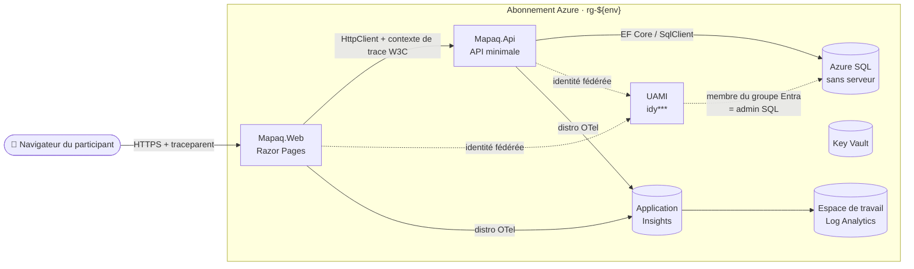

<!-- markdownlint-disable MD013 MD033 MD041 -->
# Atelier App Insights .NET 10 — MAPAQ

> 🇫🇷 **Français (ce fichier)** · 🇬🇧 **[Read me in English](README.md)**

Atelier public bilingue (FR par défaut / EN en parallèle) d'environ 2 heures qui illustre le traçage distribué Application Insights de bout en bout sur **navigateur → ASP.NET Core 10 Razor Pages → API minimale → EF Core / Azure SQL**, autour des données ouvertes du Ministère de l'Agriculture, des Pêcheries et de l'Alimentation du Québec (MAPAQ).

| | |
| --- | --- |
| **Site de l'atelier (FR par défaut)** | <https://devopsabcs-engineering.github.io/app-insights-dotnet/fr/> |
| **Site de l'atelier (EN)** | <https://devopsabcs-engineering.github.io/app-insights-dotnet/> |
| **IC** | [](.github/workflows/ci.yml) |
| **Déploiement** | [](.github/workflows/deploy.yml) |
| **Pages** | [](.github/workflows/pages.yml) |
| **Diapos** | [](.github/workflows/build-decks.yml) |
| **Vérification des liens** | [](.github/workflows/link-check.yml) |
| **Licence** | [MIT](LICENSE) |

---

## Ce que vous bâtirez

* Deux App Services ASP.NET Core 10 sous Linux — `Mapaq.Web` (Razor Pages, localisation FR par défaut, fragment JS Application Insights) et `Mapaq.Api` (API minimale + EF Core).
* Une base Azure SQL (sans serveur `GP_S_Gen5_1`, mise en pause automatique, **authentification Entra uniquement via une identité gérée affectée par l'utilisateur (UAMI)** placée dans un groupe Entra qui détient `db_owner`).
* Une ressource Application Insights basée sur un espace de travail Log Analytics, qui capture une trace distribuée par clic de l'interface — `pageView` du navigateur, requête serveur, dépendance API et dépendance SQL partagent toutes un même `operation_Id`.
* Un réseau privé : VNet + délégation de sous-réseau pour l'intégration VNet d'App Service + points de terminaison privés pour SQL.
* Un cycle de vie reproductible `azd up` / `azd down` avec un plafond de coût strict de **≤ 0,60 $ US par participant et par session de 2 heures**.

## Architecture



## Pile technique

| Couche | Choix | Notes |
| --- | --- | --- |
| Exécution | **.NET 10** (`10.0.100`, `rollForward: latestFeature`) | Épinglée dans [global.json](global.json) |
| Web | ASP.NET Core 10 Razor Pages + `Microsoft.Extensions.Localization` 10.0.0 | FR par défaut, EN bascule via `/setlang` |
| API | API minimale ASP.NET Core 10 + `Microsoft.AspNetCore.OpenApi` 10.0.0 + Swagger UI 7.2 | OpenAPI à `/openapi/v1.json`, IU à `/swagger` |
| Données | EF Core 10 + `Microsoft.Data.SqlClient` 6.1.1 | Repli en mémoire si aucune chaîne `MapaqSql` n'est fournie |
| Télémétrie | **Distro Azure Monitor OpenTelemetry** `Azure.Monitor.OpenTelemetry.AspNetCore` 1.4.0 | `SamplingRatio = 1.0F`, `TracesPerSecond = null` (intention pédagogique : capturer chaque trace) |
| Identité | `Azure.Identity` 1.14.2, `Microsoft.Identity.Web` 3.5.0 | UAMI injectée dans la chaîne SQL via `User Id={uamiClientId}` |
| Tests | xUnit 2.9 + `Microsoft.AspNetCore.Mvc.Testing` 10.0 (unitaires) · Locust (charge) · Playwright (IU) | Voir [`tests/`](tests/) |
| Infra | Bicep (portée abonnement) + `azd` | Voir [`infra/`](infra/) et [azure.yaml](azure.yaml) |

## Démarrage rapide

```pwsh
azd auth login
azd up                            # provisionne l'infra + déploie les deux apps
# essayez la démo à l'URL WEB_URI affichée
azd down --purge --force           # supprime le RG + purge KV/LAW supprimés en douceur
```

`azd up` exécute le hook post-provisionnement [`infra/scripts/grant-sql-access.{sh,ps1}`](infra/scripts/) qui ajoute le principal de l'UAMI au groupe Entra admin SQL pour que l'API puisse s'authentifier auprès d'Azure SQL. (En IC, la même étape est réalisée par le workflow lui-même — voir [Déploiement depuis l'IC](#déploiement-depuis-lic).)

## Développement local

Les applications de référence fonctionnent de bout en bout sans aucune ressource Azure grâce au repli EF Core en mémoire dans `Mapaq.Api`.

```pwsh
pwsh ./scripts/start-local.ps1     # construit + lance les deux apps en arrière-plan
# Mapaq.Web → https://localhost:7010
# Mapaq.Api → https://localhost:7020 (OpenAPI à /openapi/v1.json, Swagger à /swagger)
pwsh ./scripts/stop-local.ps1      # arrête les processus dotnet
```

Brancher la véritable télémétrie en local :

```pwsh
$cs = az monitor app-insights component show -g rg-dev-001 -a aiy*** --query connectionString -o tsv
pwsh ./scripts/start-local.ps1 -ConnectionString $cs
```

Voir [scripts/README.md](scripts/README.md) pour les options additionnelles (vraie base Azure SQL, origines personnalisées, etc.).

## Tests

```pwsh
# unitaires + intégration (Mapaq.Api.Tests, Mapaq.Web.Tests)
dotnet build Mapaq.sln /warnaserror
dotnet test  Mapaq.sln

# charge (Locust sans interface, 25 utilisateurs virtuels, 2 min, ouvre le rapport HTML)
pwsh ./scripts/load-test.ps1

# IU (Playwright)
pwsh ./scripts/run-ui-tests.ps1
```

* Les tests de charge se trouvent sous [`tests/load/`](tests/load/) — voir [tests/load/README.md](tests/load/README.md).
* Les spécifications IU se trouvent sous [`tests/ui/specs/`](tests/ui/) et sont câblées dans le [workflow ui-tests](.github/workflows/ui-tests.yml).

## Cartographie du dépôt

| Chemin | Rôle |
| --- | --- |
| [`src/Mapaq.Web/`](src/Mapaq.Web/) | Front-end Razor Pages, localisation FR par défaut, fragment JS App Insights |
| [`src/Mapaq.Api/`](src/Mapaq.Api/) | API minimale (`/api/establishments`, `/api/establishments/{id}`, `/api/inspections/rollup`, `/api/sync`) |
| [`src/Mapaq.Domain/`](src/Mapaq.Domain/) | Entités simples (`Establishment`, `Conviction`, `Suspension`, `InspectionRollup`, `SyncJob`) |
| [`src/Mapaq.Infrastructure/`](src/Mapaq.Infrastructure/) | `MapaqDbContext`, configurations EF, `MapaqDemoSeeder`, `SeedLoader` |
| [`tests/Mapaq.Api.Tests/`](tests/Mapaq.Api.Tests/) · [`tests/Mapaq.Web.Tests/`](tests/Mapaq.Web.Tests/) | Tests d'intégration xUnit + `WebApplicationFactory<Program>` |
| [`tests/load/`](tests/load/) | Tests de charge Locust |
| [`tests/ui/`](tests/ui/) | Tests IU Playwright + publication des captures d'écran |
| [`infra/main.bicep`](infra/main.bicep) | Orchestrateur à portée abonnement |
| [`infra/modules/`](infra/modules/) | `loganalytics`, `appinsights`, `identity`, `keyvault`, `vnet`, `sql`, `privateEndpoints`, `appservice`, `roleAssignments` |
| [`infra/scripts/`](infra/scripts/) | Hooks post-provisionnement `azd` (octroi par appartenance de groupe + assistant de credentials fédérés) |
| [`.github/workflows/`](.github/workflows/) | `ci`, `deploy`, `teardown`, `pages`, `build-decks`, `link-check`, `markdown-lint`, `load-test`, `ui-tests`, `seed-ado-boards` |
| [`.azuredevops/pipelines/`](.azuredevops/pipelines/) | `ci`, `deploy`, `teardown`, `load-test`, `ui-tests`, `adv-sec` (Microsoft Defender pour DevOps) |
| [`boards/`](boards/) | Backlog bilingue ADO Boards ([work-items.yaml](boards/work-items.yaml)) + [seed-ado-boards.ps1](boards/seed-ado-boards.ps1) |
| [`labs/`](labs/) · [`fr/labs/`](fr/labs/) | Contenu des ateliers rendu en site Jekyll |
| [`slides/`](slides/) | Diapos HTML bilingues façon Reveal + générateur PPTX ([content/en/](slides/content/en/), [content/fr/](slides/content/fr/)) |
| [`docs/`](docs/) | Diapos HTML pré-construites servies depuis Pages ([EN](docs/app-insights-dotnet.html), [FR](docs/app-insights-dotnet-fr.html)) |
| [`data/seed/`](data/seed/) | Échantillons CSV synthétiques dérivés des jeux Données Québec |
| [`scripts/`](scripts/) | `start-local`, `stop-local`, `load-test`, `run-load-test`, `run-ui-tests` |
| [`.devcontainer/`](.devcontainer/) | Définition Codespaces / Dev Containers (.NET 10, Node 20, Python 3.12, az/azd/gh/pwsh, Ruby 3.3 pour Jekyll) |

## Contenu de l'atelier

Sept ateliers séquentiels (~2 heures au total). Choisissez votre langue :

| # | FR | EN | Durée |
| --- | --- | --- | --- |
| 00 | [Installation](fr/labs/lab-00-installation.md) | [Setup](labs/lab-00-setup.md) | 15 min |
| 01 | [Provisionnement Azure](fr/labs/lab-01-provisionnement.md) | [Provision Azure infra](labs/lab-01-provision.md) | 15 min |
| 02 | [Instrumentation web](fr/labs/lab-02-instrumentation-web.md) | [Instrument the web tier](labs/lab-02-instrument-web.md) | 20 min |
| 03 | [Instrumentation API + SQL](fr/labs/lab-03-instrumentation-api-sql.md) | [Instrument API + SQL](labs/lab-03-instrument-api-sql.md) | 20 min |
| 04 | [Corrélation navigateur](fr/labs/lab-04-correlation-navigateur.md) | [Browser ↔ server correlation](labs/lab-04-browser-correlation.md) | 15 min |
| 05 | [Tableaux de bord](fr/labs/lab-05-tableaux-de-bord.md) | [Dashboards, KQL, alerts](labs/lab-05-dashboards.md) | 20 min |
| 06 | [Démantèlement](fr/labs/lab-06-demantelement.md) | [Teardown](labs/lab-06-teardown.md) | 15 min |

## Infrastructure

`infra/main.bicep` est un orchestrateur **à portée abonnement** qui crée `rg-${environmentName}` et appelle neuf modules. Paramètres requis :

| Paramètre | Source |
| --- | --- |
| `environmentName` | `azd env new <nom>` |
| `location` | par défaut `canadacentral` |
| `sqlAdminPrincipalId` | identifiant d'objet de l'utilisateur ou groupe Entra qui devient admin SQL |
| `sqlAdminLogin` | nom d'affichage visible dans le portail |
| `sqlAdminPrincipalType` | `User` ou `Group` (par défaut `Group`) |

Sorties (consommées par `azd env`, les scripts post-provisionnement et l'IC) :

`WEB_URI`, `API_URI`, `SQL_FQDN`, `KV_NAME`, `APPINSIGHTS_CONNECTION_STRING`, `AZURE_RESOURCE_GROUP`, `AZURE_LOCATION`, `AZURE_CLIENT_ID`, `RESOURCE_TOKEN`, `SQL_DATABASE_NAME`, `UAMI_NAME`, `UAMI_PRINCIPAL_ID`.

## Déploiement depuis l'IC

Deux pipelines d'IC/CD parallèles existent — choisissez celui qui correspond à votre plateforme :

* **GitHub Actions** ([.github/workflows/deploy.yml](.github/workflows/deploy.yml)) — connexion fédérée OIDC, contrôlée par l'environnement GitHub `workshop-dev`.
* **Azure DevOps Pipelines** ([.azuredevops/pipelines/deploy.yml](.azuredevops/pipelines/deploy.yml)) — fédération d'identité de charge de travail, mêmes étapes logiques.

Les deux workflows exécutent la même séquence post-provisionnement :

1. `azd up` (provisionnement + déploiement).
2. **Ajout de l'UAMI au groupe Entra admin SQL** — échoue rapidement sur toute erreur autre que « déjà membre » afin qu'un octroi cassé ne puisse pas passer silencieusement l'IC.
3. **Redémarrage de tous les App Services `mapaq-*`** — vide les jetons du pool de connexions `SqlClient` capturés avant l'ajout de l'UAMI au groupe, pour que la première requête après déploiement ne renvoie pas un 500 avec `Login failed for user '<token-identified principal>'`.

Les workflows de démantèlement ([GHA](.github/workflows/teardown.yml) / [ADO](.azuredevops/pipelines/teardown.yml)) suppriment le groupe de ressources avec `az` (et non `azd down` — l'état azd vit sur le runner qui a exécuté `azd up`, qui n'existe jamais sur un runner d'IC neuf) puis purgent Key Vault et Log Analytics supprimés en douceur pour que le même nom d'environnement puisse être reprovisionné sans collision.

## Règle de parité bilingue

Le contenu est rédigé d'abord en **anglais**, mais le **français est la langue publiée par défaut**. Toute modification d'un atelier, d'une diapositive ou d'un fichier de prose de premier niveau doit mettre à jour les deux langues — voir [CONTRIBUTING.md](CONTRIBUTING.md).

## Licence

[MIT](LICENSE)

## Contribuer

Voir [CONTRIBUTING.md](CONTRIBUTING.md).
