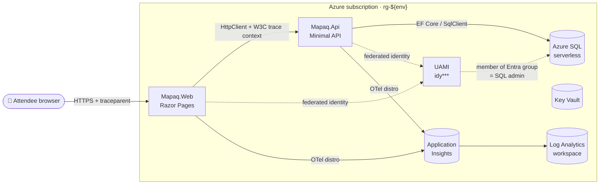

<!-- markdownlint-disable MD013 MD033 MD041 -->
# App Insights .NET 10 — MAPAQ Workshop

> 🇬🇧 **English (this file)** · 🇫🇷 **[Lisez-moi en français](README.fr.md)**

A public bilingual (FR-default / EN-parallel) ~2-hour workshop that demonstrates end-to-end Application Insights distributed tracing across **browser → ASP.NET Core 10 Razor Pages → Minimal API → EF Core / Azure SQL**, themed around open data from the Ministère de l'Agriculture, des Pêcheries et de l'Alimentation du Québec (MAPAQ).

| | |
| --- | --- |
| **Workshop site (FR default)** | <https://devopsabcs-engineering.github.io/app-insights-dotnet/fr/> |
| **Workshop site (EN)** | <https://devopsabcs-engineering.github.io/app-insights-dotnet/> |
| **CI** | [](.github/workflows/ci.yml) |
| **Deploy** | [](.github/workflows/deploy.yml) |
| **Pages** | [](.github/workflows/pages.yml) |
| **Decks** | [](.github/workflows/build-decks.yml) |
| **Link check** | [](.github/workflows/link-check.yml) |
| **License** | [MIT](LICENSE) |

---

## What you'll build

* Two ASP.NET Core 10 Linux App Services — `Mapaq.Web` (Razor Pages, FR-default localization, JS Application Insights snippet) and `Mapaq.Api` (Minimal API + EF Core).
* An Azure SQL Database (serverless `GP_S_Gen5_1`, auto-pause, **Entra-only auth via a User-Assigned Managed Identity** in an Entra group that holds `db_owner`).
* A workspace-based Application Insights resource that captures one distributed trace per UI click — browser pageView, server request, downstream API dependency, and SQL dependency all share a single `operation_Id`.
* A private network: VNet + subnet delegation for App Service VNet integration + private endpoints for SQL.
* A reproducible `azd up` / `azd down` lifecycle with a hard cost ceiling of **≤ $0.60 USD per attendee per 2-hour run**.

## Architecture



## Tech stack

| Layer | Choice | Notes |
| --- | --- | --- |
| Runtime | **.NET 10** (`10.0.100`, `rollForward: latestFeature`) | Pinned in [global.json](global.json) |
| Web | ASP.NET Core 10 Razor Pages + `Microsoft.Extensions.Localization` 10.0.0 | FR-default, EN switchable via `/setlang` |
| API | ASP.NET Core 10 Minimal API + `Microsoft.AspNetCore.OpenApi` 10.0.0 + Swagger UI 7.2 | OpenAPI at `/openapi/v1.json`, UI at `/swagger` |
| Data | EF Core 10 + `Microsoft.Data.SqlClient` 6.1.1 | In-memory fallback when no `MapaqSql` connection string is supplied |
| Telemetry | **Azure Monitor OpenTelemetry Distro** `Azure.Monitor.OpenTelemetry.AspNetCore` 1.4.0 | `SamplingRatio = 1.0F`, `TracesPerSecond = null` (workshop intent: capture every trace) |
| Identity | `Azure.Identity` 1.14.2, `Microsoft.Identity.Web` 3.5.0 | UAMI baked into SQL connection string via `User Id={uamiClientId}` |
| Tests | xUnit 2.9 + `Microsoft.AspNetCore.Mvc.Testing` 10.0 (unit) · Locust (load) · Playwright (UI) | See [`tests/`](tests/) |
| Infra | Bicep (subscription scope) + `azd` | See [`infra/`](infra/) and [azure.yaml](azure.yaml) |

## Quick start

```pwsh
azd auth login
azd up                            # provisions infra + deploys both apps
# play with the demo at the printed WEB_URI
azd down --purge --force           # tears down rg + purges soft-deleted KV/LAW
```

`azd up` runs the [`infra/scripts/grant-sql-access.{sh,ps1}`](infra/scripts/) postprovision hook that adds the UAMI principal to the SQL admin Entra group so the API can authenticate to Azure SQL. (In CI the same step is performed by the workflow itself — see [Deploying from CI](#deploying-from-ci).)

## Local development

The reference apps run end-to-end without any Azure resources thanks to the EF Core in-memory fallback in `Mapaq.Api`.

```pwsh
pwsh ./scripts/start-local.ps1     # builds + launches both apps in background pwsh windows
# Mapaq.Web → https://localhost:7010
# Mapaq.Api → https://localhost:7020 (OpenAPI at /openapi/v1.json, Swagger at /swagger)
pwsh ./scripts/stop-local.ps1      # kills the dotnet processes
```

Wire up real telemetry locally:

```pwsh
$cs = az monitor app-insights component show -g rg-dev-001 -a aiy*** --query connectionString -o tsv
pwsh ./scripts/start-local.ps1 -ConnectionString $cs
```

See [scripts/README.md](scripts/README.md) for additional flags (real Azure SQL, custom origins, etc.).

## Tests

```pwsh
# unit + integration (Mapaq.Api.Tests, Mapaq.Web.Tests)
dotnet build Mapaq.sln /warnaserror
dotnet test  Mapaq.sln

# load (Locust headless, 25 VU, 2 min, opens HTML report)
pwsh ./scripts/load-test.ps1

# UI (Playwright)
pwsh ./scripts/run-ui-tests.ps1
```

* Load tests live in [`tests/load/`](tests/load/) — see [tests/load/README.md](tests/load/README.md).
* UI specs live in [`tests/ui/specs/`](tests/ui/) and are wired into the [ui-tests workflow](.github/workflows/ui-tests.yml).

## Repository layout

| Path | Purpose |
| --- | --- |
| [`src/Mapaq.Web/`](src/Mapaq.Web/) | Razor Pages front-end, FR-default localization, JS App Insights loader snippet |
| [`src/Mapaq.Api/`](src/Mapaq.Api/) | Minimal API (`/api/establishments`, `/api/establishments/{id}`, `/api/inspections/rollup`, `/api/sync`) |
| [`src/Mapaq.Domain/`](src/Mapaq.Domain/) | Plain entities (`Establishment`, `Conviction`, `Suspension`, `InspectionRollup`, `SyncJob`) |
| [`src/Mapaq.Infrastructure/`](src/Mapaq.Infrastructure/) | `MapaqDbContext`, EF configurations, `MapaqDemoSeeder`, `SeedLoader` |
| [`tests/Mapaq.Api.Tests/`](tests/Mapaq.Api.Tests/) · [`tests/Mapaq.Web.Tests/`](tests/Mapaq.Web.Tests/) | xUnit + `WebApplicationFactory<Program>` integration tests |
| [`tests/load/`](tests/load/) | Locust load tests |
| [`tests/ui/`](tests/ui/) | Playwright UI tests + screenshot publisher |
| [`infra/main.bicep`](infra/main.bicep) | Subscription-scope orchestrator |
| [`infra/modules/`](infra/modules/) | `loganalytics`, `appinsights`, `identity`, `keyvault`, `vnet`, `sql`, `privateEndpoints`, `appservice`, `roleAssignments` |
| [`infra/scripts/`](infra/scripts/) | `azd` postprovision hooks (group-membership grant + federated credential helper) |
| [`.github/workflows/`](.github/workflows/) | `ci`, `deploy`, `teardown`, `pages`, `build-decks`, `link-check`, `markdown-lint`, `load-test`, `ui-tests`, `seed-ado-boards` |
| [`.azuredevops/pipelines/`](.azuredevops/pipelines/) | `ci`, `deploy`, `teardown`, `load-test`, `ui-tests`, `adv-sec` (Microsoft Defender for DevOps) |
| [`boards/`](boards/) | Bilingual ADO Boards backlog ([work-items.yaml](boards/work-items.yaml)) + [seed-ado-boards.ps1](boards/seed-ado-boards.ps1) |
| [`labs/`](labs/) · [`fr/labs/`](fr/labs/) | Lab content rendered as a Jekyll site |
| [`slides/`](slides/) | Bilingual reveal-style HTML decks + PPTX builder ([content/en/](slides/content/en/), [content/fr/](slides/content/fr/)) |
| [`docs/`](docs/) | Pre-built HTML decks served from Pages ([EN](docs/app-insights-dotnet.html), [FR](docs/app-insights-dotnet-fr.html)) |
| [`data/seed/`](data/seed/) | Synthetic CSV seed snapshots derived from Données Québec datasets |
| [`scripts/`](scripts/) | `start-local`, `stop-local`, `load-test`, `run-load-test`, `run-ui-tests` |
| [`.devcontainer/`](.devcontainer/) | Codespaces / Dev Containers definition (.NET 10, Node 20, Python 3.12, az/azd/gh/pwsh, Ruby 3.3 for Jekyll) |

## Workshop content

Seven sequential labs (~2 hours total). Pick your language:

| # | EN | FR | Timebox |
| --- | --- | --- | --- |
| 00 | [Setup](labs/lab-00-setup.md) | [Installation](fr/labs/lab-00-installation.md) | 15 min |
| 01 | [Provision Azure infra](labs/lab-01-provision.md) | [Provisionnement Azure](fr/labs/lab-01-provisionnement.md) | 15 min |
| 02 | [Instrument the web tier](labs/lab-02-instrument-web.md) | [Instrumentation web](fr/labs/lab-02-instrumentation-web.md) | 20 min |
| 03 | [Instrument API + SQL](labs/lab-03-instrument-api-sql.md) | [Instrumentation API + SQL](fr/labs/lab-03-instrumentation-api-sql.md) | 20 min |
| 04 | [Browser ↔ server correlation](labs/lab-04-browser-correlation.md) | [Corrélation navigateur](fr/labs/lab-04-correlation-navigateur.md) | 15 min |
| 05 | [Dashboards, KQL, alerts](labs/lab-05-dashboards.md) | [Tableaux de bord](fr/labs/lab-05-tableaux-de-bord.md) | 20 min |
| 06 | [Teardown](labs/lab-06-teardown.md) | [Démantèlement](fr/labs/lab-06-demantelement.md) | 15 min |

## Infrastructure

`infra/main.bicep` is a **subscription-scope** orchestrator that creates `rg-${environmentName}` and dispatches nine modules. Required parameters:

| Parameter | Source |
| --- | --- |
| `environmentName` | `azd env new <name>` |
| `location` | default `canadacentral` |
| `sqlAdminPrincipalId` | object id of the Entra user/group that becomes SQL admin |
| `sqlAdminLogin` | display name shown in the portal |
| `sqlAdminPrincipalType` | `User` or `Group` (default `Group`) |

Outputs (consumed by `azd env`, postprovision scripts, and CI):

`WEB_URI`, `API_URI`, `SQL_FQDN`, `KV_NAME`, `APPINSIGHTS_CONNECTION_STRING`, `AZURE_RESOURCE_GROUP`, `AZURE_LOCATION`, `AZURE_CLIENT_ID`, `RESOURCE_TOKEN`, `SQL_DATABASE_NAME`, `UAMI_NAME`, `UAMI_PRINCIPAL_ID`.

## Deploying from CI

Two parallel CI/CD pipelines exist — pick the one matching your platform:

* **GitHub Actions** ([.github/workflows/deploy.yml](.github/workflows/deploy.yml)) — OIDC federated login, gated on the `workshop-dev` GitHub Environment.
* **Azure DevOps Pipelines** ([.azuredevops/pipelines/deploy.yml](.azuredevops/pipelines/deploy.yml)) — workload-identity federation, same logical steps.

Both workflows run the same post-provision sequence:

1. `azd up` (provision + deploy).
2. **Add UAMI to the SQL admin Entra group** — fails fast on any error other than "already a member" so a broken grant cannot silently pass CI.
3. **Restart all `mapaq-*` App Services** — drops the `SqlClient` connection-pool tokens captured before the UAMI was added to the group, so the first request after deploy does not 500 with `Login failed for user '<token-identified principal>'`.

The teardown workflows ([GHA](.github/workflows/teardown.yml) / [ADO](.azuredevops/pipelines/teardown.yml)) delete the resource group with `az` (not `azd down` — azd state lives on the runner that ran `azd up`, which never exists on a fresh CI runner) and purge soft-deleted Key Vault + Log Analytics so the same env name can be re-provisioned without collisions.

## Bilingual parity rule

Content is authored in **English first** but **French is the published default** language. Every change to a lab, deck slide, or top-level prose file must update both languages — see [CONTRIBUTING.md](CONTRIBUTING.md).

## License

[MIT](LICENSE)

## Contributing

See [CONTRIBUTING.md](CONTRIBUTING.md).
